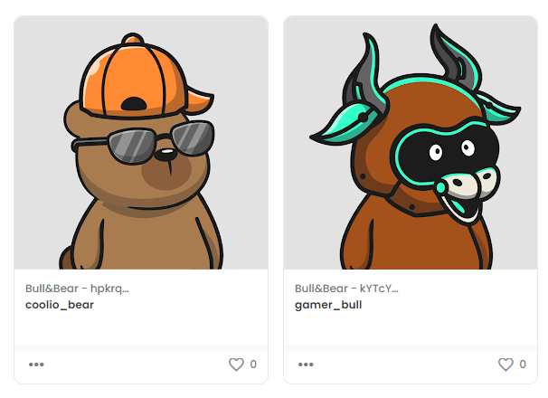

# RoadToWeb3 Chainlink Dynamic NFT

## This project includes:

* How to connect your Solidity smart contracts with Oracles.
* How to get tokens' price data using Chainlink datafeeds.
* How to use Chainlink Keepers
* How to use Chainlink VRF (to generate random numbers)
* How to change the metadata of your tokens based on Market data.

----

## Open issues & tweaks:

* // TODO: Create own NFTs array
* // TODO: Use only "integer" part of Price to avoid triggering upkeepers on every decimal price variation

----

## How to use

* Upload and deploy on Remix
* Create a Chainlink Keeper and associate it with the contract address
* Create a Chainlink VRF subscription and associate it with the contract address
* execute safeMint (you can see the NFT on https://testnets.opensea.io/)
* check checkUpkeep [] 
* check tokenURI [0]
* check contract events in etherscan (look for TokensUpdated event)
* check if uriIndex & tokenURI have changed
* update NFT metadata and check new randomly selected image

